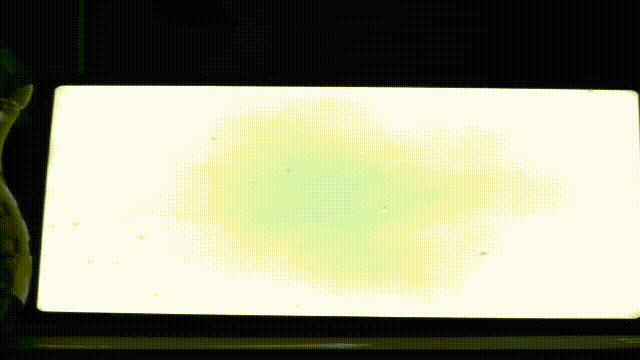
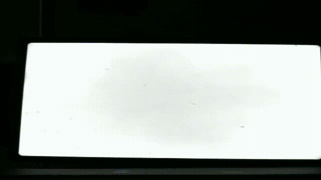
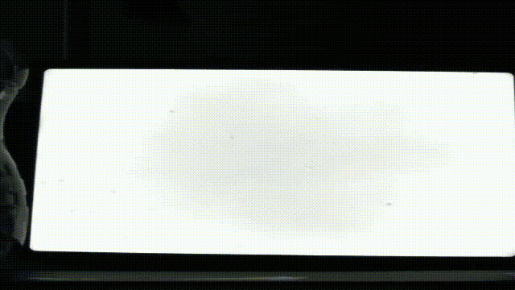

# Industrial Foreign Object Detection Pipeline

This repository implements a complete real-time computer vision pipeline for detecting and classifying foreign objects on an industrial production line video. It follows a 5-step architecture as specified in the given task.

---

## 🔧 Requirements

```bash
pip install -r req.txt
```

---

## 🎯 Pipeline Overview (5 Steps)

### 01\_initial\_detection

> Fast and lightweight object detection using background subtraction.

**File:** `background_subtraction_demo.py`

- Uses OpenCV MOG2 subtractor to detect moving objects.
- Applies morphological operations to clean the mask.
- Draws bounding boxes on detected regions.

#### ▶️ How to Run

```bash
python 01_initial_detection/background_subtraction_demo.py
```

> Input video path is hardcoded as `"test1.avi"` inside the script. You can change it as needed.

#### Output

---




---

### 02\_object\_tracking

> Assigns persistent object IDs using Centroid Tracking.

**File:** `centroid_tracking_demo.py`

- Tracks the detected bounding boxes from step 1.
- Assigns a unique ID per object.
- Displays trajectory and ID overlays.

**Dependency:** `tracker.py`

- Contains the `CentroidTracker` class implementation.

#### ▶️ How to Run

```bash
python 02_object_tracking/centroid_tracking_demo.py
```

#### Output

---



---

### 03\_autoencoder\_module

> Trains and evaluates an autoencoder model for anomaly detection.

#### 📂 `dataset/`

Contains cropped training images (clean samples).

#### 🧠 Training

**File:** `train_autoencoder.py`

- Builds and trains a convolutional autoencoder.
- Saves the best model using early stopping.

```bash
python 03_autoencoder_module/train_autoencoder.py
```

#### 🧪 Inference

**File:** `detect_anomaly_ssim.py`

- Loads the trained model.
- Uses Structural Similarity Index (SSIM) to flag anomalies.
- Annotates frame as Anomaly or Normal based on SSIM score and temporal consistency.

```bash
python 03_autoencoder_module/detect_anomaly_ssim.py
```

#### 🧰 Crop Generation Tools

- `generate_crops_from_video.py`: Extracts motion-based crops.
- `generate_centered_crops.py`: Center-crops based on bounding boxes.

```bash
python 03_autoencoder_module/generate_crops_from_video.py
python 03_autoencoder_module/generate_centered_crops.py
```

#### Output

---



---

### 04\_yolo\_inference\_pipeline

> Applies YOLOv8 model only to anomalous crops.

#### 🧹 YOLO Classification

**Files:**

- `extract_anomaly_crops.py`: Saves detected anomaly crops for YOLO labeling.
- `yolo_bottle_model.zip`: Contains trained YOLOv8 weights.
- `YOLOv8_Tutorial.ipynb`: Used to train the YOLOv8 model.

#### 📋 Workflow

1. Run `extract_anomaly_crops.py` to save only the anomalous crops detected by the autoencoder.
2. Upload these crops to [Roboflow](https://app.roboflow.com/ds/F4yO3Sq95r?key=i0ZGPWv2cx) and label them (e.g., Bottle, Cap, Bubble, etc.).
3. Export the labeled dataset in YOLOv8 format.
4. Train the YOLOv8 model using `YOLOv8_Tutorial.ipynb`. This notebook includes:
   - Loading Roboflow dataset
   - Training the model
   - Saving final weights

#### ▶️ How to Run

```bash
python 04_yolo_inference_pipeline/extract_anomaly_crops.py
```

To train the model:

```bash
# Open in Jupyter and run all cells
YOLOv8_Tutorial.ipynb
```

---

### 05\_final\_pipeline\_and\_logging

> Integrates all modules: detection, tracking, anomaly detection, YOLO classification, and logging.

**File:** `final_pipeline_inference.py`

- Loads autoencoder and YOLO models.
- For each frame:
  - Detects moving objects
  - Tracks IDs
  - Extracts crops and evaluates anomaly via SSIM
  - If anomalous, runs YOLO classification
  - Logs results to `output/anomaly_log.csv`
  - Saves final annotated video to `output/final_output.avi`

#### 📂 output/

- `final_output.avi`: Output video with bounding boxes and class labels.
- `anomaly_log.csv`: Logs object ID, frame number, SSIM score, and YOLO class name (if detected).

#### ▶️ How to Run

```bash
python 05_final_pipeline_and_logging/final_pipeline_inference.py
```

#### Output

---


---

## 🎥 Input Video Files

- `test1.avi`: Main input video with foreign objects.
- `mixed_test.avi`: (Optional) Additional test video.
- `autoencoding_clean.avi`: Used to create clean crops.

---

## ✅ Deliverables

- 📹 Final video with anomaly detection + YOLO classification.
- 🧠 Python source code (5 modular folders).
- 📁 Log file: `anomaly_log.csv`

---

## 🙋 Contact

Developed by Ali Gökkaya as part of a computer vision job application task.

